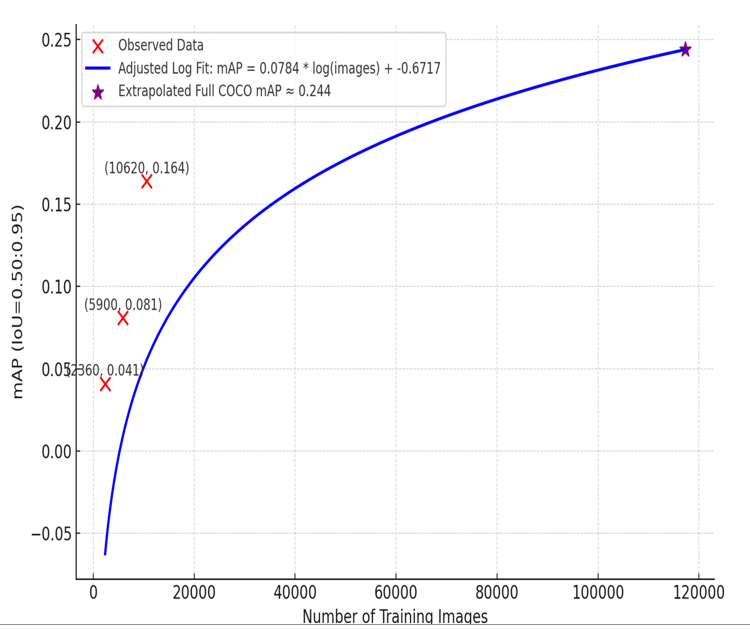

# Assignment A9: SparseSwin

---

This repo is the implementation of SparseSwin: Swin Transformer with Sparse Transformer Block </a>.  

## Results on Cifar10

| Model          | #Params  | Input Resolution | Model Type   | Accuracy (%) |
|----------------|----------|------------------|--------------|--------------|
| ResNet XnIDR   | 23.86 M  | 224x224          | Convolution  | 96.87        |
| NesT-B         | 97.2 M   | 32x32            | Transformer  | 97.2         |
| CRATE-B        | 13.12 M  | 224x224          | Transformer  | 96           |
| CRATE-L        | 77.64 M  | 224x224          | Transformer  | 97.2         |
| SparseSwin (T) | 17.58 M  | 224x224          | Transformer  | 97.43        |
| Assignment A-9 | 17.58 M  | 512x512          | Transformer  | 96.08        |

## Results on Cifar100

| Model          | #Params  | Input Resolution | Model Type   | Accuracy (%) |
|----------------|----------|------------------|--------------|--------------|
| ResNet Xt-50   | 25.03 M  | 224x224          | Convolution  | 84.42        |
| NesT-B         | 97.2 M   | 32x32            | Transformer  | 82.56        |
| CRATE-B        | 22.80 M  | 224x224          | Transformer  | 82.7         |
| CRATE-L        | 77.64 M  | 224x224          | Transformer  | 83.6         |
| SparseSwin (T) | 17.58 M  | 224x224          | Transformer  | 85.35        |
| Assignment A-9 | 17.58 M  | 512x512          | Transformer  | 82.69        |
## SparseSwin Detection using coco subsets

Because of the availability of LIMITED compute GPU resource and drive space, I have used the concept of learning curve. Learning Curve
In machine learning, a learning curve is a plot showing how a model’s performance changes as you give it more training data.
on its X-axis: it shows how much “resource” you give usually dataset size, but could also be compute resources, training steps, or parameters.
whereas Y-axis represents model performance accuracy, loss, or mAP, depending on the task.
advantages of Extrapolation from the Curve gives you an estimate on Larger datasets you haven’t trained on yet, Bigger models,More compute time.
This is called extrapolation because you’re extending the curve beyond your observed points.

<figure>
    

        
        <figcaption><b>Fig. 1</b> Ms coco extrapolated results using multiple subsets</figcaption>
    

</figure>
