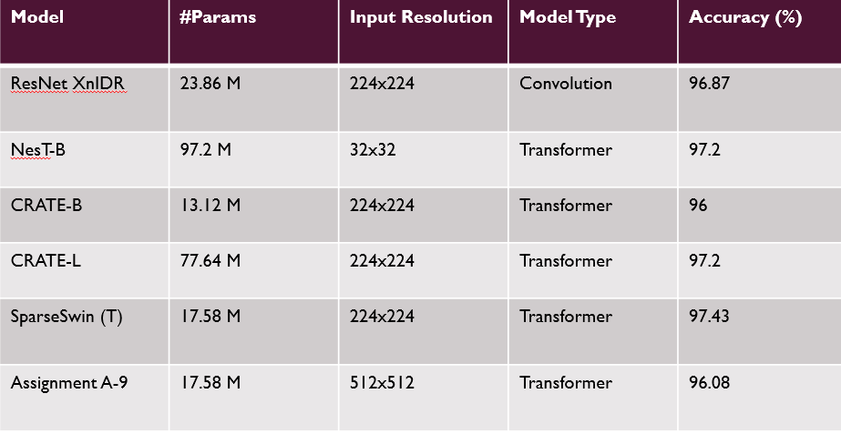
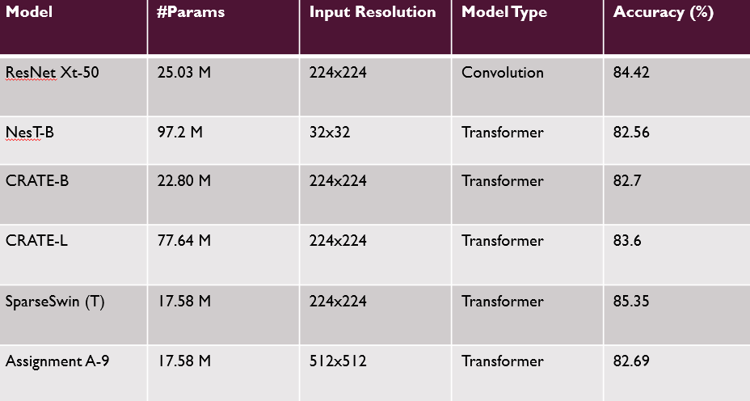

# Assignment A9: SparseSwin

---

This repo is the implementation of SparseSwin: Swin Transformer with Sparse Transformer Block </a>.  

## Results on Cifar10

Model overview
Model : SparseSwin Transformer
Dataset : Cifar10
Task : Image Classification
Training Configuration
Optimizer : AdamW
Epochs : 20

<figure>
    

        
        <figcaption><b>Fig. 1</b> Cifar10 results</figcaption>
    

</figure>

## Results on Cifar100

Model overview
Model : SparseSwin Transformer
Dataset : Cifar100
Task : Image Classification
Training Configuration
Epochs : 20
Regularization : Disabled
Batch size : 12
Num Workers : 8
<figure>
    

        
        <figcaption><b>Fig. 1</b> Cifar100 results</figcaption>
    

</figure>

## SparseSwin Detection using coco subsets

Because of the availability of LIMITED compute GPU resource and drive space, I have used the concept of learning curve. Learning Curve
In machine learning, a learning curve is a plot showing how a model’s performance changes as you give it more training data.
on its X-axis: it shows how much “resource” you give usually dataset size, but could also be compute resources, training steps, or parameters.
whereas Y-axis represents model performance accuracy, loss, or mAP, depending on the task.
advantages of Extrapolation from the Curve gives you an estimate on Larger datasets you haven’t trained on yet, Bigger models,More compute time.
This is called extrapolation because you’re extending the curve beyond your observed points.

<figure>
    

        
        <figcaption><b>Fig. 1</b> Ms coco extrapolated results using multiple subsets</figcaption>
    

</figure>
